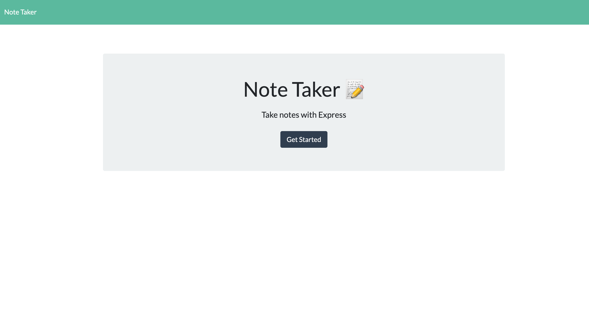
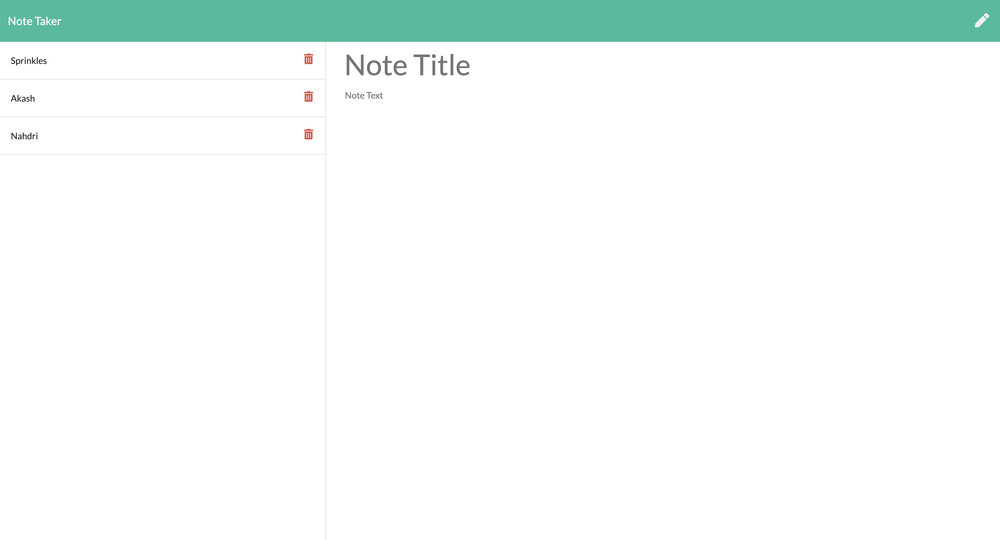

# Note-Pad
## Project Description

[Template Engine README](https://lynseahoss.github.io/Template-Engine/)

This project is a simple application that allows users to create, save and delete notes. The user is able to use the text field to enter a note which is then stored in an array on a server. The application is deployed on Heroku for the server to run and function properly.   

This is a responsive application that has foundation in HTML, CSS, Javascript, Node.js, Express and Bootstrap. It utilizes Heroku cloud service. 
## Deployment

  

## Table of Contents

  * [User Story](#user-story)
  * [Acceptance Criteria](#acceptance-criteria)
  * [Project Technology](#project-technology)
  * [Screenshots of Application](#screenshots-of-application)
  * [Contributing Authors](#contributing-authors)

----

  ## User Story

    ```
    AS A Busy Student I need to take notes 
    I WANT to save and delete notes 
    SO THAT I can stay organised 
    ```

  ## Acceptance Criteria

    ```
    GIVEN the user wants to enter a new note
    WHEN the user types the note in the text field
    THEN the note is saved to the server and displayed on the screen
    WHEN the user wants to delete a note
    THEN user clicks the trash icon and the note is removed from the screen & server
    ```

----

## Project Technology
<details>
    <summary markdown="span">Click to expand Project Technology Details</summary>

Languages
- HTML
- CSS
- Javascript
- Node.js
- Express.js


CSS Framework
- [BootStrap](https://getbootstrap.com/)


Cloud Server
- [Heroku](heroku.com/)

</details>


## Screenshots of Application
<details>
    <summary markdown="span">Click to expand Screenshot Details</summary>


*Screenshot of Home Page*


*Screenshot of Notes Page*

</details>


## Contributing Author

[Lindsey Lawson](https://github.com/lynseahoss)


